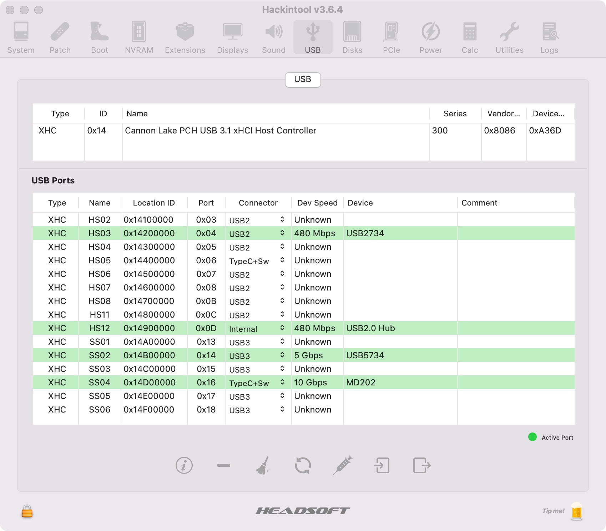

# Hackintosh with OpenCore

Update: [OpenCore 0.7.5](https://github.com/acidanthera/OpenCorePkg)

## 0x00 Hardware
| Index | Name              | Model                                                                   |
|-------|-------------------|-------------------------------------------------------------------------|
| 1     | CPU               | [i7-8700K](https://item.jd.com/18794427126.html)                        |
| 2     | CPU Cooler        | [noctua NH-D15S](https://item.jd.com/2248429.html)                      |
| 3     | Motherboard       | [ROG Maximus XI Hero Wi-Fi M11H ](https://item.jd.com/35017810977.html) |
| 4     | RAM               | [Kingston Fury DDR4 3200 16GBx2](https://item.jd.com/100005089420.html) |
| 5     | Solid State Drive | [SAMSUNG 970 EVO Plus 512G](https://item.jd.com/100003181110.html)      |
| 6     | Power Supply      | [USCORSAIR RM550x](https://item.jd.com/6757757.html)                    |
| 7     | Case              | [JONSBO U5 ATX](https://item.jd.com/8885801.html)                       |
| 8     | Monitor           | [DELL 2718QM](https://item.jd.com/4585499.html)                         |
| 9     | Network Card      | [BCM943602CS](https://item.taobao.com/item.htm?id=608922155647)         |

## 0x01 Status

目前用到的功能都完美。
- Monitor：4K，正常， HiDPI：正常
- WIFI：正常
- Bluetooth：正常
- AirDrop：可用
- Sleep/Resume：正常

## 0x02 Custom USB

|       | Index | USB2.0(USB1.1) | USB3.0 |
|-------|:-----:|:----------------:|:----:|
| 1     | a     | 12             |       |
| 2     | b     | 11            |        |
| 3     | c     |  6              |  22      |
| 4     | d     |  5              |   21     |
| 5     | e     |   7             |   23     |
| 6     | f     |  8              |  24      |
| 7     | g     |  3              |  19      |
| 8     | h     |   4             |   20     |

> 13: Apple Bluetooth USB1.1

## 0x03 Tools

### OpenCore
[OpenCore](https://github.com/acidanthera/OpenCorePkg)

### Drives
- [OpenCore](https://github.com/acidanthera/OpenCorePkg)
- [WhateverGreen](https://github.com/acidanthera/WhateverGreen)
- [Lilu](https://github.com/acidanthera/Lilu)
- [VirtualSMC](https://github.com/acidanthera/VirtualSMC)
- [AppleALC](https://github.com/acidanthera/AppleALC)
- [RTCMemoryFixup](https://github.com/acidanthera/RTCMemoryFixup)
- [BrcmPatchRAM](https://github.com/acidanthera/BrcmPatchRAM)
- [AirportBrcmFixup](https://github.com/acidanthera/AirportBrcmFixup)

### Tools
- [ProperTree](https://github.com/corpnewt/ProperTree)
- [MacInfoPkg](https://github.com/acidanthera/MacInfoPkg)
- [GenSMBIOS](https://github.com/corpnewt/GenSMBIOS)
- [gibMacOS](https://github.com/corpnewt/gibMacOS)
- [MountEFI](https://github.com/corpnewt/MountEFI)
- [SSDTTime](https://github.com/corpnewt/SSDTTime)
- [balenaEtcher](https://github.com/balena-io/etcher/releases)
- [MaciASL](https://github.com/acidanthera/MaciASL/releases)

### Downlad
`python3 OC.py`

## 0xFF Reference

1. [Coffee Lake](https://dortania.github.io/OpenCore-Desktop-Guide/config.plist/coffee-lake.html)
2. [Intel Coffee Lake平台完美黑苹果系统安装教程](https://www.bilibili.com/video/BV1hA411t7dr)
3. [精解OpenCore-黑果小兵](https://blog.daliansky.net/OpenCore-BootLoader.html)
4. [OpenCore Desktop Guide](https://dortania.github.io/OpenCore-Desktop-Guide/)
5. [AppleSupportPkg-Factory](https://github.com/athlonreg/AppleSupportPkg-Factory/)
